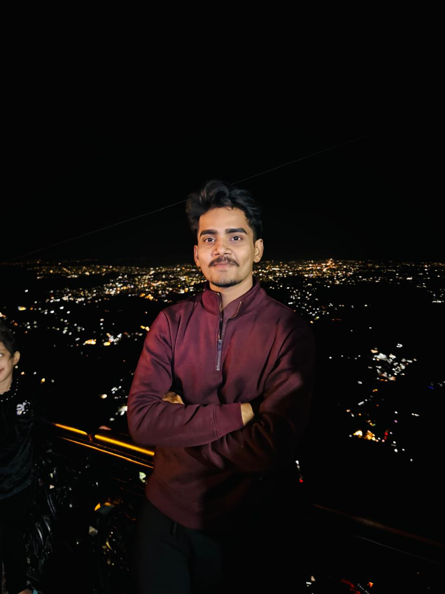

# 🚀 Ashish Prasad – Developer Portfolio

<div align="center">
  <br />
  <a href="https://akprasad.vercel.app" target="_blank">
    
  </a>
  <br />
  <div>
    
    
    
    
    
  </div>
  <h3 align="center">Explore my portfolio website — Projects, Skills, and a way to connect with me</h3>
  <div align="center">
    <a href="https://akprasad.vercel.app" target="_blank"><b>🔗 Visit Portfolio</b></a>
  </div>
  <br />
</div>

---

## 📌 About

I’m Ashish Prasad, a full-stack developer pursuing B.Tech in Computer Science from IIITDM Jabalpur. I specialize in building modern, scalable, and responsive web apps. This portfolio showcases my featured projects, development skills, and includes a working contact form for freelance or job opportunities.

---

## ⚙️ Tech Stack

- **React + Vite** – Lightning-fast frontend development
- **TailwindCSS** – For beautiful, utility-first styling
- **Lucide Icons** – Lightweight, customizable icon set
- **Radix UI** – Accessible UI component primitives
- **Web3Forms + Toast** – For form handling and UX notifications
- **Vercel** – Deployed and hosted on Vercel
- **GitHub Actions (optional)** – For CI/CD

---

## 💡 Features

- 🎨 Modern animated hero section with my image
- 🌙 Dark/light mode toggle
- 🧠 Skill filters with animated transitions
- 🛠️ Live project showcase with GitHub/demo links
- 📩 Contact form powered by Web3Forms + custom toast
- 📱 Fully responsive — mobile and tablet ready
- 🔍 Smooth scroll + sticky navbar with hide-on-scroll

---

## 📁 Projects Included

| Project      | Description                                                                                  | Link |
|--------------|----------------------------------------------------------------------------------------------|------|
| **University Website** | Official IIITDM portal clone with SSR, SEO, admin panel                         | [Live](http://13.201.19.145:5000) |
| **AlphaIO**           | Social platform with real-time chat, JWT auth, Cloudinary media                   | [Live](https://alphaio.onrender.com) |
| **CodeArena**         | Competitive programming platform with Docker, Python scraping, real-time sync     | -    |
| **Portfolio Site**    | This site, made with React + TailwindCSS                                           | [Live](https://akprasad.vercel.app) |

---

## 🖥️ Local Development

```bash
git clone https://github.com/AkprasadoP/myPortfolio.git
cd myPortfolio
npm install
npm run dev
